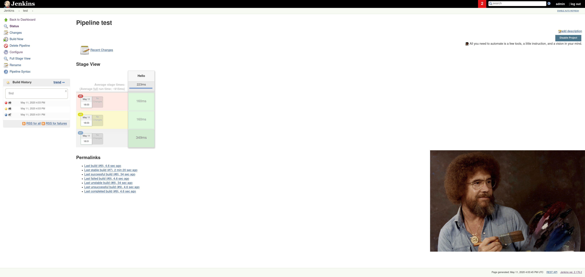
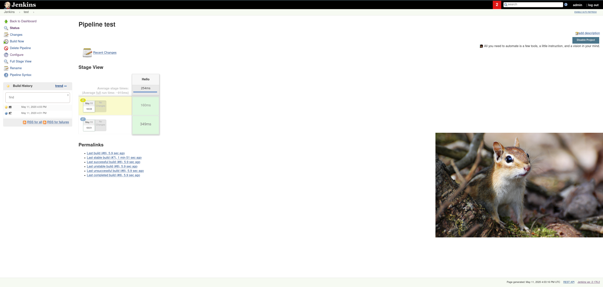
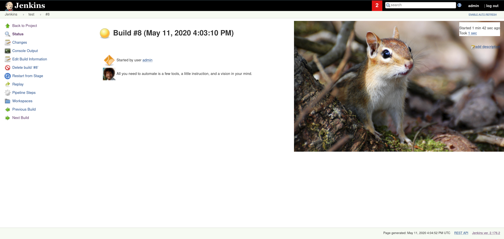
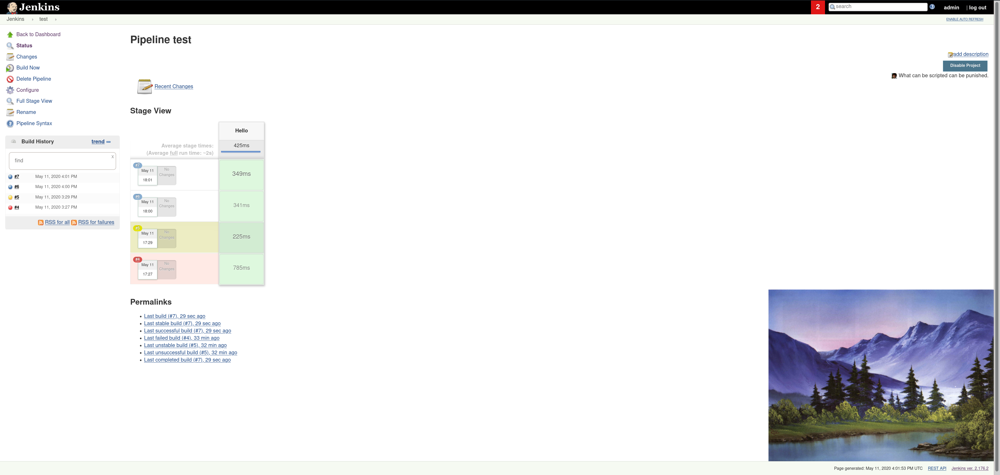
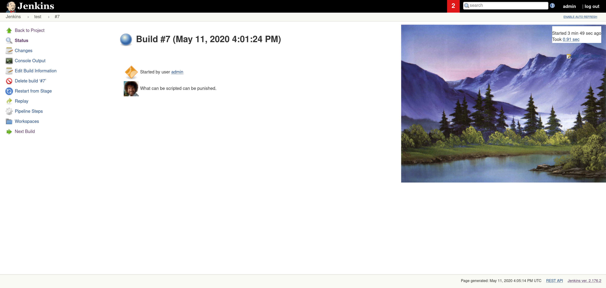

# Bob Ross Jenkins Plugin

## Intro

This plugin adds an absolutely delightful feature to Jenkins:
depending if your build succeeds, fails, or is unstable, it will show
a picture of Bob Ross *auto-adapting* (that's right, computer science it is!) to the build result!

Seeing that, already many dozens (yes, *dozens*!) of people have decided to take the
plunge and install this plugin to finally see the light. Why not you?

## Real intro

**In all seriousness though, this is simply the [ChuckNorris Jenkins plugin](https://github.com/jenkinsci/chucknorris-plugin), but completely "reskinned" to represent Bob Ross. 
The way the plugin works is completely the same, just the images, quotes and some class and function names are different.**

**I'm not affiliated with Bob Ross in any way, just a fan. Go to https://www.twitch.tv/bobross to support his ongoing livestream. As far as I know it is maintained by the people that run https://www.bobross.com.**

**Original code was written by [Cliffano Subagio / cliffano](https://github.com/cliffano) in 2009.**

## Samples

### Failure

### Unstable

### Success

