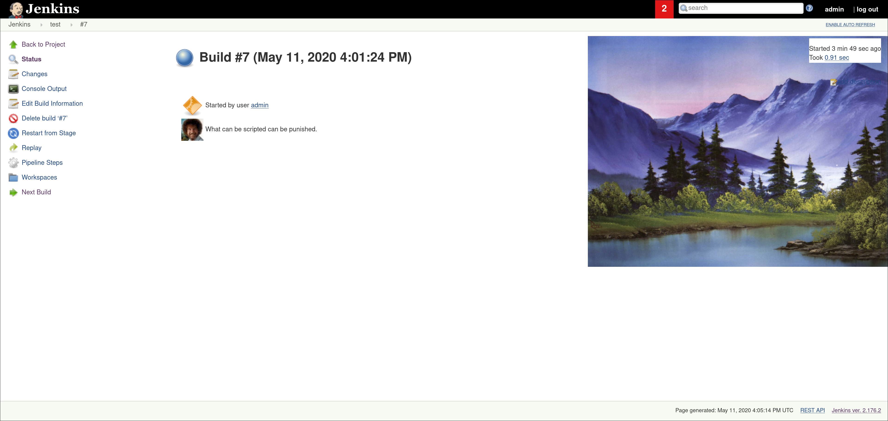

# Bob Ross Jenkins Plugin


## Intro

This plugin adds an absolutely delightful feature to Jenkins:
depending if your build succeeds, fails, or is unstable, it will show
a picture of Bob Ross *auto-adapting* (that's right, computer science it is!) to the build result!

Seeing that, already many dozens (yes, *dozens*!) of people have decided to take the
plunge and install this plugin to finally see the light. Why not you?

## Real intro

**In all seriousness though, this is simply the [ChuckNorris Jenkins plugin](https://github.com/jenkinsci/chucknorris-plugin), but completely "reskinned" to represent Bob Ross. 
The way the plugin works is completely the same, just the images, quotes and some class and function names are different.**

**DON'T use this on production worthy Jenkins instances, I have no idea what I'm doing when writing Java code. I literally find-replaced everything that was Chuck related into something that was Bob related.**

**I'm not affiliated with the late Bob Ross in any way, just a fan. Go to https://www.twitch.tv/bobross to support his ongoing 24/7 Twitch livestream. As far as I know it is maintained by the people that run https://www.bobross.com.**

**Original code was written by [Cliffano Subagio / cliffano](https://github.com/cliffano) in 2009.**

## Samples

### Failure

Get a comforting portait of a confident and forgiving man when your build fails. Don't forget to [beat the devil](https://www.youtube.com/watch?v=KM971KEFVco) out of the developer that failed your build when you're done fixing that sucker.


### Unstable

Get a confused but cute little [animal](https://www.youtube.com/watch?v=1koOWsj70d4) when things are a bit unstable.


### Success

Get a beautiful piece of landscape with the possibility of happy little trees as a reward for successful builds.




## Install

Download the latest release and upload the .hpi file under the advanced section of your Jenkins' plugins page.

## Usage

Preferrably in the `always` section of the `post` section of a [Jenkins Pipeline](https://www.jenkins.io/doc/book/pipeline/).

```
pipeline {
   agent any

   stages {
      stage('Hello') {
         steps {
            echo "hello world"
         }
      }
   }
   
   post {
      always {
         bobRoss()
      }
   }
}
```

## To-do

* Finish adding releasing into the Github Actions pipeline. (currently broken)
* Add picking random images to Style.java. ** See the dynamicImagesBadlyImplementedAndTestsFailing branch for that disaster. **
* Find a solution for adding .png files.
* Add more images (see unused folder).
* Add more quotes.
* (long term) See if this can be integrated into Blue Ocean. Probably needs some more .css/html magic.

